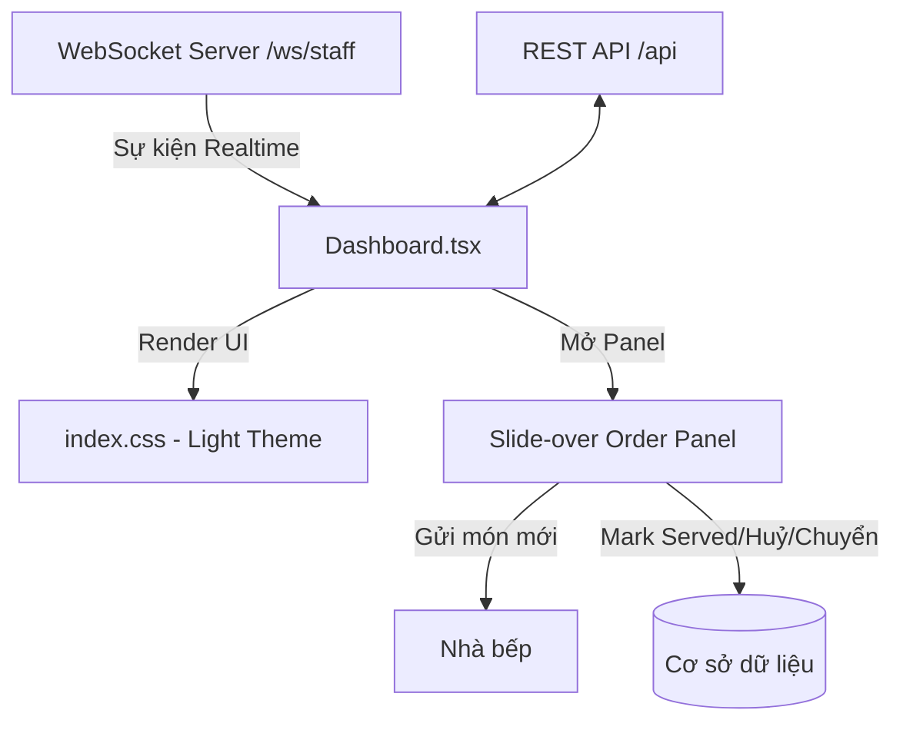

# Tài liệu Review: Chức năng Cổng Phục vụ Nhân viên (Staff Web)

Tài liệu này tổng hợp toàn bộ cấu trúc, tính năng, và các chỉ dẫn kỹ thuật liên quan đến cổng phục vụ nhân viên (`staff-web`) hiện tại. Bạn có thể sử dụng tài liệu này để xem xét và sửa đổi hệ thống theo mong muốn.

---

## 1. Bản đồ Kiến trúc & Luồng Dữ liệu Realtime

Hệ thống giao diện được thiết kế theo mô hình **SPA React** tối giản, giao tiếp với backend FastAPI qua **REST API** kết hợp **WebSocket** thời gian thực để cập nhật tình trạng bàn và đơn hàng:



---

## 2. Chi tiết các Chức năng Core & Cách Thao tác

### 2.1. Sơ đồ Bàn Thông minh (Table Map Grid)
* **Phân loại loại bàn (Capacity):**
  * Được tính tự động qua hàm `getTableCapacity(tableNum)`.
  * Hiển thị nhãn trực quan: **Bàn 2 người**, **Bàn 5 người**, **Bàn 8 người** cùng icon `User` nhỏ gọn.
* **Bộ lọc khu vực (Floor Filter):**
  * Tự động gom nhóm các tầng hiện có từ API và tạo ra các tab lọc nhanh (`Tầng 1`, `Tầng 2`, `Tất cả`).
* **Trực quan hóa Tiến trình Phục vụ (Realtime Progress Bar):**
  * Đối với các bàn có khách (`occupied`), thẻ bàn hiển thị một thanh tiến trình màu xanh ngọc biểu thị tỉ lệ món đã giao thành công (Ví dụ: `Tiến độ món: 3/5` -> Thanh tiến trình đạt 60%).
  * Giúp nhân viên biết ngay bàn nào đang bị trễ món để đốc thúc nhà bếp.
* **Cảnh báo thanh toán:**
  * Bàn ở trạng thái `waiting_payment` sẽ có viền màu vàng hổ phách nhấp nháy liên tục (`pulse-glow-border`).

---

### 2.2. Bảng Gọi món & Chi tiết Bàn (Slide-over Panel)
Trượt mượt mà từ cạnh phải màn hình khi click chọn một bàn hoạt động. Chia làm 2 tab chính:

#### Tab 1: Tiến độ & Thanh toán
* **Danh sách món đã đặt:** Liệt kê các món ăn kèm số lượng, ghi chú đặc biệt và trạng thái chế biến thời gian thực (`Chờ duyệt`, `Đã nhận`, `Đang nấu`, `Chờ phục vụ`, `Phục vụ`).
* **Nghiệp vụ Phục vụ món:** Khi món ăn chuyển sang trạng thái `Chờ phục vụ` (bếp nấu xong), nhân viên phục vụ chạm vào biểu tượng checkmark xanh lá để chuyển trạng thái thành `Phục vụ` (served).
* **Đề xuất huỷ món:**
  * Nếu món chưa nấu (trạng thái pending/confirmed): Huỷ trực tiếp ngay lập tức.
  * Nếu món đang nấu (`cooking`): Gửi đề xuất huỷ lên Quản lý kèm lý do chi tiết (gọi API `/cancel-request`).
* **Đổi bàn (Transfer Table):**
  * Nhấp nút "Đổi bàn" ➜ Mở Modal danh sách các bàn trống ➜ Chọn bàn trống cần chuyển sang ➜ Hệ thống tự động chuyển toàn bộ hoá đơn và phiên gọi món sang bàn mới.
* **Yêu cầu thanh toán (Đã loại bỏ nút bấm):**
  * Nút "Yêu cầu thanh toán" đã bị loại bỏ khỏi bảng điều khiển của nhân viên phục vụ. Chỉ duy nhất khách hàng mới có thể kích hoạt yêu cầu thanh toán từ thiết bị của họ.
  * Khi khách hàng bấm yêu cầu thanh toán, hệ thống sẽ hiển thị một biểu ngữ thông báo tĩnh **"Khách đang chờ thanh toán"** màu vàng hổ phách nổi bật trong Slide-over panel để nhân viên nhận biết trực quan mà không thể thực hiện thao tác bấm gửi trùng lặp.

#### Tab 2: Gọi món mới (Đã loại bỏ)
* **Trạng thái:** Đã loại bỏ hoàn toàn chức năng này theo yêu cầu (nhân viên không thực hiện đặt món mới từ Slide-over panel của sơ đồ bàn nữa, thay vào đó tập trung theo dõi tiến trình và thanh toán).

---

### 2.3. Duyệt Đơn hàng (Pending Orders Approval)
* Danh sách các đơn đặt món do khách tự gọi từ điện thoại được đồng bộ realtime.
* **[TÍNH NĂNG MỚI] Nhân viên chỉnh sửa đơn hàng trước khi duyệt:**
  * Nhân viên có thể trực tiếp tăng/giảm số lượng từng món ăn của khách, hoặc xoá bỏ món ăn ra khỏi đơn hàng thông qua bộ nút Stepper và nút xoá (Trash) ngay tại giao diện.
  * Nhân viên có thể chỉnh sửa ghi chú chi tiết cho từng món ăn.
  * Khi bấm **"Duyệt đơn"**, hệ thống sẽ tự động đồng bộ hoá và cập nhật danh sách món ăn đã chỉnh sửa lên database trước khi chuyển sang nhà bếp.
  * Nhân viên vẫn có thể chọn **"Từ chối"** đơn hàng nếu cần thiết.

---

## 3. Cấu trúc Tệp tin để Sửa đổi

### 3.1. Giao diện & Logic: [Dashboard.tsx](file:///d:/PTUD/smart-restaurant/frontend/packages/staff-web/src/pages/Dashboard.tsx)
* **Các state chính cần lưu ý khi sửa đổi:**
  * `tables`: Danh sách bàn từ API `/tables`.
  * `pendingOrders`: Danh sách đơn hàng chờ duyệt.
  * `tableActiveInvoices`: Map lưu trữ chi tiết tiến độ món ăn và hoá đơn tạm tính của từng bàn.
  * `cartItems`: Giỏ hàng gọi món mới của nhân viên tại bàn.
* **Các hàm API tích hợp:**
  * `handleMarkServed(detailId, tableId, tableNumber)`: Xác nhận phục vụ món.
  * `handleCancelDetail(detailId, status, tableId, tableNumber)`: Huỷ hoặc gửi yêu cầu huỷ món.
  * `handleTransferTable(sessionId, destTableId, destTableNumber)`: Chuyển bàn.
  * `handleSendToKitchen(sessionId, tableId, tableNumber)`: Gửi món mới chọn thêm vào bếp.

### 3.2. Hệ thống CSS & Stylesheet: [index.css](file:///d:/PTUD/smart-restaurant/frontend/packages/staff-web/src/index.css)
Định nghĩa hệ màu **Light Theme** chuyên nghiệp dạng iPad POS cao cấp:
```css
:root {
  --bg-primary: #f6f8fa;          /* Nền chính nhẹ nhàng */
  --bg-secondary: #ffffff;        /* Nền thẻ trắng tinh khiết */
  --accent-primary: #ff5722;      /* Cam hoàng hôn kích thích vị giác */
  --accent-secondary: #20c997;    /* Xanh ngọc bảo thị Phục vụ/Có khách */
  --accent-warning: #f59e0b;      /* Vàng hổ phách biểu thị Chờ thanh toán */
  
  --border-radius-md: 16px;       /* Border mềm mại cho Tablet */
  --border-radius-lg: 24px;
}
```

---

## 4. Gợi ý Hướng phát triển Tiếp theo
1. **Phân quyền nâng cao:** Thêm cấu hình cho phép chỉ phục vụ viên được gán cho tầng đó mới có quyền thao tác trên sơ đồ bàn của tầng tương ứng.
2. **Offline Mode:** Tích hợp bộ đệm Service Worker để nhân viên vẫn có thể xem danh sách món ăn và ghi nhận đơn hàng tạm thời vào LocalStorage nếu mạng Wi-Fi của nhà hàng bị chập chờn.
